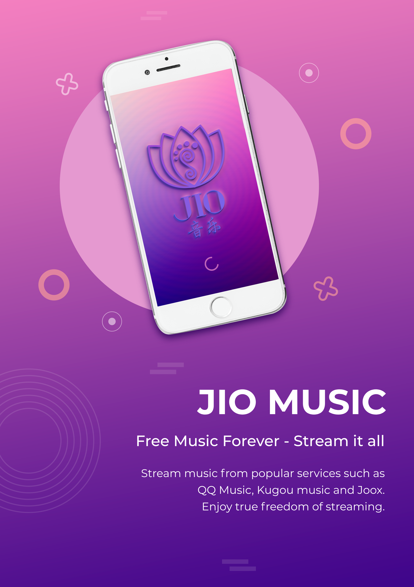
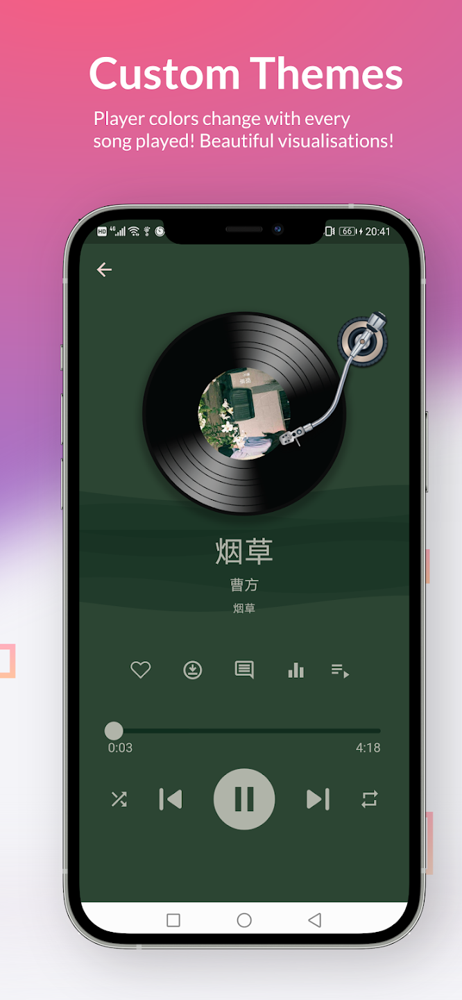
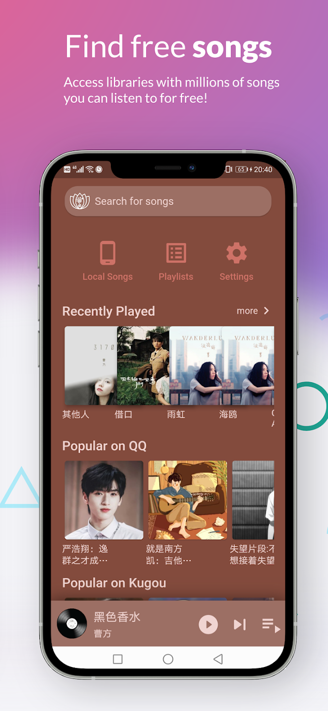
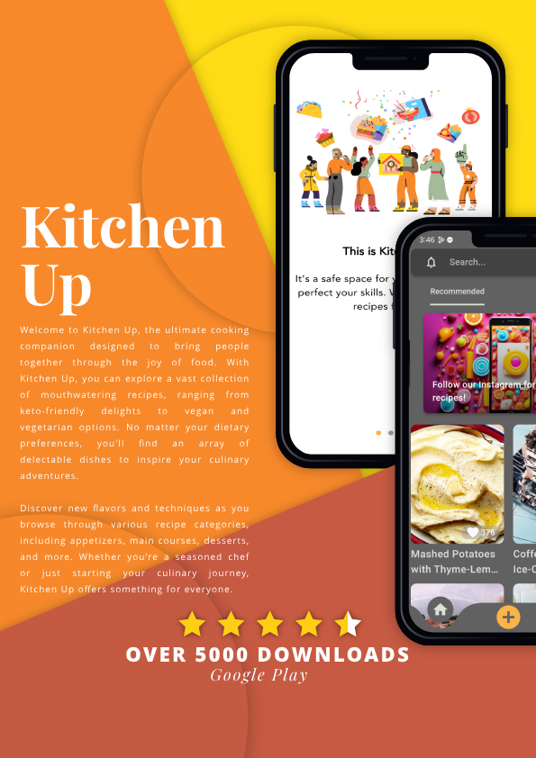
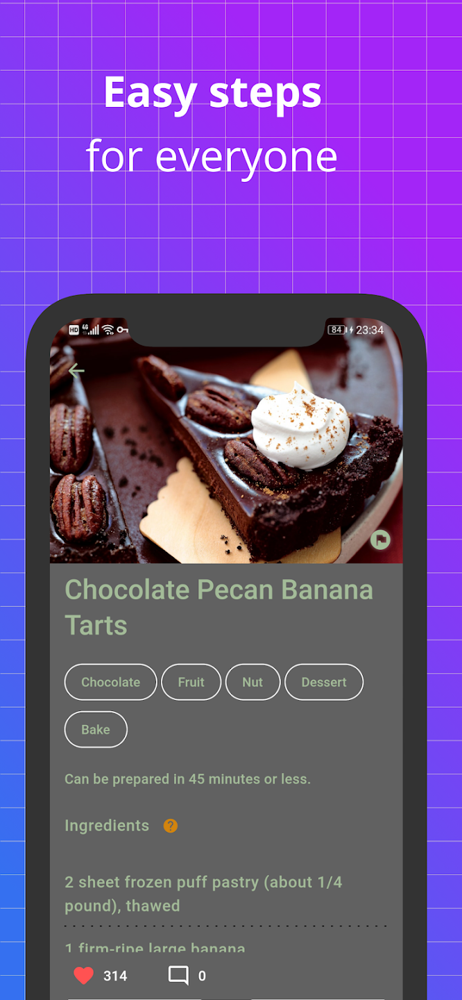
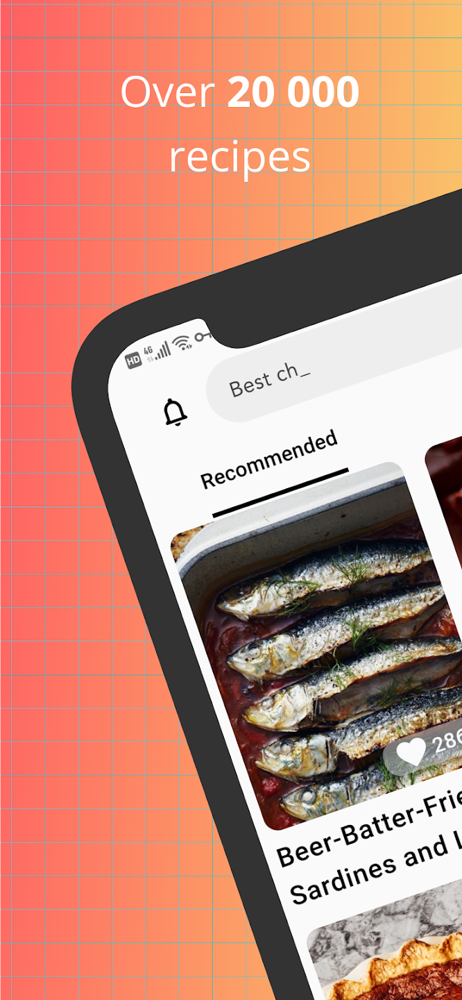
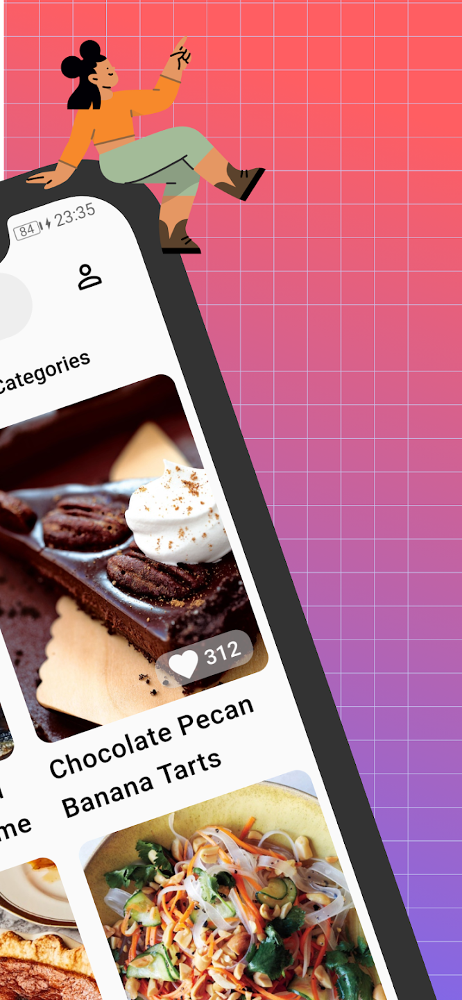

#   Alex (mcs2k8) - Senior Mobile and Full-Stack Developer/Tech Lead
&nbsp;&nbsp;&nbsp;&nbsp; 

 👋  Hello! I'm Alex, a highly experienced Senior Mobile Developer and Tech Lead with over 10 years of experience in iOS, Android, and cross-platform development (Flutter/React Native). I have a proven ability to architect scalable mobile solutions, lead teams, and deliver high-performance applications. My expertise spans full-stack development, bridging mobile and backend technologies to create comprehensive solutions.

##   Core Competencies

* **Mobile Development:** iOS (Swift, Swift UI, Objective-C, Core Data), Android (Kotlin, Java, Jetpack Compose), Cross-Platform (Flutter, Dart, React Native), Mobile SDK Development, Espresso, Lottie
* **Full-Stack Development:**
    * Frontend: JavaScript, TypeScript, HTML/CSS, React.js, AngularJS, Bootstrap, jQuery, UI/UX Design, Responsive Design
    * Backend: Python (Django, FastAPI), Node.js, REST APIs, GraphQL, Data Structures & Algorithms, Design Patterns, Enterprise Software Architecture
    * Database: SQL (MySQL, Postgres), NoSQL, Data Science, Data Models, BigQuery
* **Software Architecture:** Design Patterns, Clean Architecture, SOLID Principles, Enterprise Software Architecture
* **DevOps & Cloud:** Google Cloud Platform (GCP), Firebase, Docker, Nginx, Git, Maven, Gradle, CI/CD (GitLab, in-house Ruby solution)
* **Project Management:** Agile, Scrum (Certified ScrumMaster), Kanban, MVP, Test Automation, Atlassian, Jira, Phabricator
* **Tools & Software:** Excel/Numbers/Sheets, Figma, Adobe Photoshop, Unity
* **Languages:** French, Mandarin, Spanish, Hebrew, Russian

##   Values and Approach

I am a Certified ScrumMaster with a strong focus on clean architecture, code quality, and data-driven decisions. I believe in fostering collaboration and contributing to positive work environments.

##   Good Vibes

Good vibes are very important to me. Whether it is at work, at home, or anywhere else, it's important that we contribute goodness and kindness to the world. I believe that we should advocate for truth and kindness.

##   Professional Highlights

* **Cross-Platform Expertise:** Proficient in developing cross-platform applications using Flutter and React Native, enabling efficient development for both iOS and Android.
* **SDK Development:** Extensive experience in developing and maintaining SDKs for various platforms (iOS, Android, JavaScript, WeChat), with a focus on performance optimization and standardization.
* **API Integration & Optimization:** Proven ability to integrate RESTful APIs and optimize applications for performance and memory management, including experience with reverse engineering APIs (e.g., Jio Music).
* **Technical Leadership:** Experience in leading mobile engineering teams, providing technical guidance, and driving strategic planning in Agile environments.
* **Full-Stack Capabilities:** Demonstrated ability to work across the full stack, from mobile development to backend development and database management.

##   Featured Projects

* **Jio Music:**
    * A free music player with integrated access to popular streaming services.
    * **Contributions:** Delved into the behind-the-scenes work on audio streaming, reverse-engineering APIs, and optimizing apps for memory.
    * **Link to Google Play Store:** [Jio Music](https://play.google.com/store/apps/details?id=co.whitedragon.music_player)
* **Kitchen Up:**
    * A beautifully designed recipes application with integrated AI capabilities.
    * **Highlight:** Demonstrates expertise in UI/UX design and AI integration.
    * **Link to Google Play Store:** [Kitchen Up](https://play.google.com/store/apps/details?id=co.whitedragon.little_kitchen)
* **Watchland:**
    * A Samsung Watch application with over 100,000 downloads.
    * **Significance:** My first major application, showcasing my early success in mobile development.
    * **Link to project/information:** [Watchland](https://watchland.ca/)
* **Mapgears:**
    * A real-time mapping and tracking solution for various industries (sport, waste removal, etc.).
    * **Responsibilities:** Leading development and decision-making for Mapgears' mobile product ecosystem.
    * **Tech Stack:** iOS (SwiftUI, Core Data), Android (Kotlin Multiplatform, Jetpack Compose), Backend (Flask, Firebase), CI/CD (in-house Ruby solution with Firebase and GCP).
* **Tongdao:**
    * Marketing and analytics SDK to collect user data and facilitate intelligent marketing campaigns.
    * **Responsibilities:** Managed a mobile engineering team, enhanced SDK performance, led CI/CD integration.
    * **Impact:** Achieved a 300% reduction in file size through optimization.
    * **Tech Stack:** iOS (Objective-C, Swift, Core Data, RESTful APIs), Android (Java, Kotlin), Flutter (Dart), JavaScript/TypeScript, WeChat HTML5, CI/CD (GitLab, GCP).
* **Daragon Technology:**
    * Full-stack solution for sharing large watchface files between users globally.
    * **Responsibilities:** Directed a cross-functional team, acted as the primary technical lead.
    * **Tech Stack:** iOS (Swift, Swift UI, Objective-C, Core Data, RESTful APIs), Android (Java, Kotlin), Backend (Django, Python, Nginx, PostgreSQL, Firebase).
* **Quickmobile:**
    * Event management software for Android, used by Fortune 500 companies.
    * **Responsibilities:** Developed customized mobile components, optimized SQL database queries.
    * **Tech Stack:** Android, Java, MySQL, JUnit, Espresso.
* **Beaver Mama (Archived):**
    * My first Flutter application, which solidified my belief in the framework's capabilities.
    * **Importance:** A key project in my transition to and specialization in Flutter development.

##   Connect with Me

* **LinkedIn:** [https://www.linkedin.com/in/alexgon](https://www.linkedin.com/in/alexgon)
* **GitHub:** [https://github.com/mcs2k8](https://github.com/mcs2k8)
* **Email:** alexandergoncharov88@gmail.com
